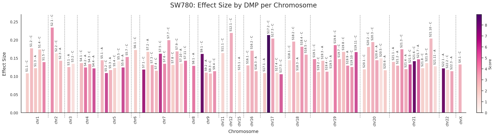
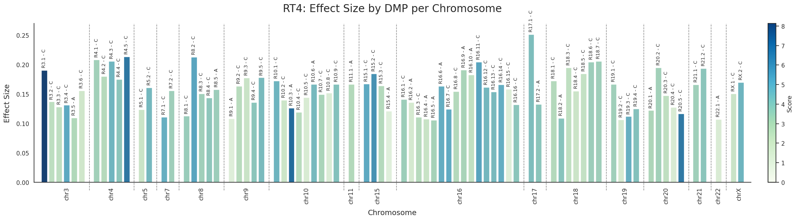
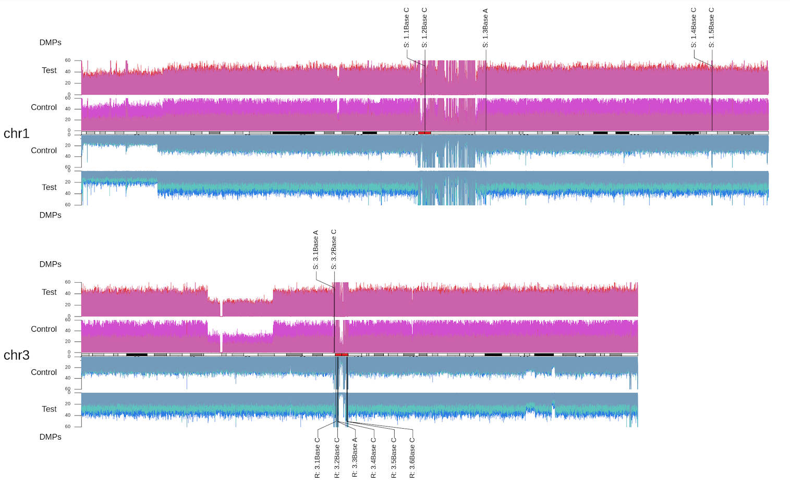
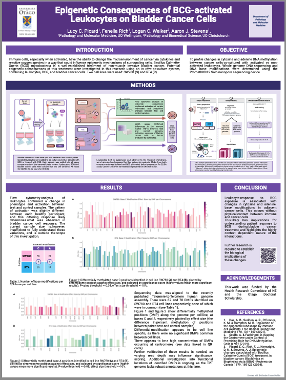

# Epigenetic Consequences of BCG-activated Leukocytes on Bladder Cancer Cells

Kia ora!  
This is a place for additional public information about our project first presented by poster at the GeneMappers conference, Christchurch NZ (2024).

**Abstract:**  
Epigenetic consequences of cancer treatments is an underexplored area of research. Instillations of BCG mycobacteria into the bladder to stimulate an immune response is an established treatment for non-muscle invasive bladder cancer (NMIBC). Immune cells, especially when activated, have the ability to change the microenvironment of cancer via cytokines and reactive oxygen species in a way that could influence epigenetic mechanisms of surrounding cells. Aberrant DNA methylation of sites around the centromere has also been correlated with genome instability.

Our research was an hypothesis-free exploration of epigenetic and structural changes in bladder cancer cells in response to BCG-activated immune cells. Bladder cancer cells were co-cultured with leukocytes either with or without BCG, in a transwell system designed to prevent physical interactions with bladder cancer cells. Whole genome sequencing of bladder cancer cell lines was carried out on the PromethION 2 Solo instrument by Oxford Nanopore Technologies, which, in addition to DNA sequencing, can also detect DNA modifications. In addition to methylation of CpG sites (5mC), methylation of Adenosine sites (m6A) and structural changes to the genome were also investigated.
This research is a novel exploration of immune stimulatory effects on cancer cell DNA structure and function. It utilises native DNA nanopore sequencing to probe modification changes not only on cytosine but also adenine, due to leukocyte activity.

### Authors

* **Lucy Picard**
* Fenella Rich
* A/Prof Diane Kenwright
* A/Prof Logan Walker
* Dr. Aaron Stevens

## Full DMP Effect Size figures

These include C and A modifications on the same plot, with identifier names to match to the below karyoplot.  
[SW780 DMPs](SW780_effect_size.png)  
[RT4 DMPs](RT4_effect_size.png)  

*Preview*  
  

## Chromosomal locations of DMPs in Fig 1 and Fig 2

For now this is a link so as not to overwhelm this page, I hope to put up a more condensed version here soon.  
[Karyoplot of DMPs](Karyoplot_DMP_coverage.png)  

*Preview*  

## Poster
[Poster link](Epi-BlCa-BCG-Poster.pdf)

*Preview*  

## Software and model versions used for analysis

* [Dorado v0.6.0](https://github.com/nanoporetech/dorado)
* *Basecalling model*: dna_r10.4.1_e8.2_400bps_sup@v4.3.0
* *5mCG and 5hmCG modified bases model*: dna_r10.4.1_e8.2_400bps_sup@v4.3.0_5mCG_5hmCG>@v1
* *6mA modified bases model*: dna_r10.4.1_e8.2_400bps_sup@v4.3.0_6mA>@v2
* [Modkit v0.3.1](https://github.com/nanoporetech/modkit)
* *T2T genome*: [T2T-CHM13v2.0](https://github.com/marbl/CHM13?tab=readme-ov-file#t2t-chm13v20-t2t-chm13y)

## External Links

[Department of Pathology and Moleular Medicine](https://www.otago.ac.nz/wellington/departments/pathologymolecularmedicine), University of Otago, Wellington.
